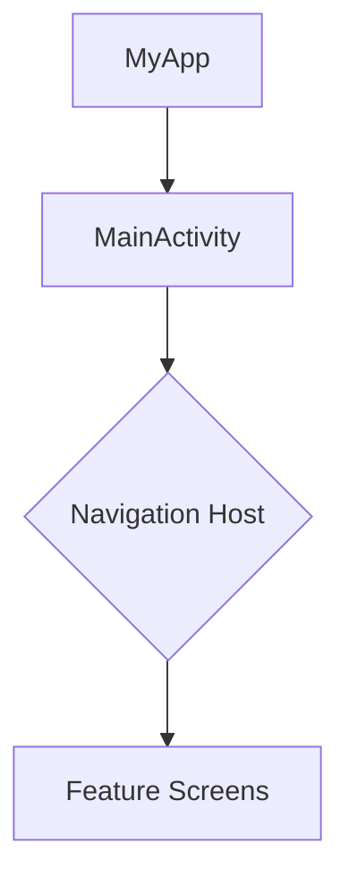

# Project Base

A robust Android project template utilizing modern Android development practices and architecture.

## 🛠 Tech Stack

*   **Language**: [Kotlin](https://kotlinlang.org/)
*   **Minimum SDK**: 29 (Android 10)
*   **Target SDK**: 36
*   **Java Version**: 17
*   **Gradle Version**: 9.0
*   **Build System**: Gradle Kotlin DSL (`.kts`)
*   **Architecture**: MVVM (Model-View-ViewModel)

### 📦 Key Libraries
*   **Android Jetpack**:
    *   **Navigation Component**: For handling in-app navigation.
    *   **Paging 3**: For loading and displaying pages of data.
    *   **DataBinding**: For binding UI components layouts to data sources.
*   **Networking**:
    *   **Retrofit 2**: type-safe HTTP client.
    *   **OkHttp**: HTTP client.
*   **UI Components**:
    *   **Material Design**: For UI styling and components.
    *   **SwipeRefreshLayout**: For pull-to-refresh functionality.

## 👤 Author

**khoa083**

## 🔄 Activity Flow

The application follows a standard single-activity architecture where fragments (or other composables/views) are managed within the main activity container.



## 🚀 Deployment & Setup

### Prerequisites
*   **Android Studio** (Latest Stable version recommended)
*   **JDK 17** must be installed and configured as the Gradle JDK.

### Installation
1.  **Clone the repository**:
    ```bash
    git clone <repository-url>
    ```
2.  **Open in Android Studio**:
    *   Launch Android Studio -> Open -> Select the cloned project folder.
3.  **Sync Gradle**:
    *   Wait for the project to sync dependencies. ensure your internet connection is active.
4.  **Run the App**:
    *   Select a connected device or emulator (API 29+).
    *   Click the **Run** button (Green Play Icon).

## 📖 Usage Examples

This project uses a robust Base Architecture. Below are standard implementation guides for the core base classes.

### BaseFragment
Used for all Fragments to standardize DataBinding and ViewModel initialization.

```kotlin
class HomeFragment : BaseFragment<FragmentHomeBinding, HomeViewModel>() {

    // 1. Define Layout ID
    override val layoutId: Int = R.layout.fragment_home
    
    // 2. Initialize ViewModel (or use Koin/Hilt injection)
    override val mViewModel: HomeViewModel by viewModels()

    // 3. Setup Views (called after onViewCreated)
    override fun setupView(fragmentBinding: FragmentHomeBinding) {
        fragmentBinding.btnAction.setOnClickListener {
            mViewModel.doSomething()
        }
        
        // Observe UiState from BaseViewModel
        lifecycleScope.launch {
            mViewModel.uiState.collect { state ->
                // handle loading, error, success
            }
        }
    }
}
```

