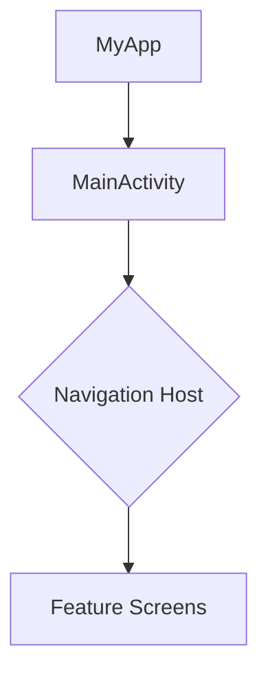

# Project Base

A robust Android project template utilizing modern Android development practices and architecture.

## 🛠 Tech Stack

*   **Language**: [Kotlin](https://kotlinlang.org/)
*   **Minimum SDK**: 29 (Android 10)
*   **Target SDK**: 36
*   **Java Version**: 17
*   **Gradle Version**: 9.0
*   **Build System**: Gradle Kotlin DSL (`.kts`)
*   **Architecture**: MVVM (Model-View-ViewModel)

### 📦 Key Libraries
*   **Android Jetpack**:
    *   **Navigation Component**: For handling in-app navigation.
    *   **Paging 3**: For loading and displaying pages of data.
    *   **DataBinding**: For binding UI components layouts to data sources.
*   **Networking**:
    *   **Retrofit 2**: type-safe HTTP client.
    *   **OkHttp**: HTTP client.
*   **UI Components**:
    *   **Material Design**: For UI styling and components.
    *   **SwipeRefreshLayout**: For pull-to-refresh functionality.

## 👤 Author

**khoa083**

## 🔄 Activity Flow

The application follows a standard single-activity architecture where fragments (or other composables/views) are managed within the main activity container.



## 🚀 Deployment & Setup

### Prerequisites
*   **Android Studio** (Latest Stable version recommended)
*   **JDK 17** must be installed and configured as the Gradle JDK.

### Installation
1.  **Clone the repository**:
    ```bash
    git clone <repository-url>
    ```
2.  **Open in Android Studio**:
    *   Launch Android Studio -> Open -> Select the cloned project folder.
3.  **Sync Gradle**:
    *   Wait for the project to sync dependencies. ensure your internet connection is active.
4.  **Run the App**:
    *   Select a connected device or emulator (API 29+).
    *   Click the **Run** button (Green Play Icon).

## 📖 Usage Examples

This project uses a robust Base Architecture. Below are standard implementation guides for the core base classes.

### 1. BaseFragment
Used for all Fragments to standardize DataBinding and ViewModel initialization.

```kotlin
class HomeFragment : BaseFragment<FragmentHomeBinding, HomeViewModel>() {

    // 1. Define Layout ID
    override val layoutId: Int = R.layout.fragment_home
    
    // 2. Initialize ViewModel (or use Koin/Hilt injection)
    override val mViewModel: HomeViewModel by viewModels()

    // 3. Setup Views (called after onViewCreated)
    override fun setupView(fragmentBinding: FragmentHomeBinding) {
        fragmentBinding.btnAction.setOnClickListener {
            mViewModel.doSomething()
        }
        
        // Observe UiState from BaseViewModel
        lifecycleScope.launch {
            mViewModel.uiState.collect { state ->
                // handle loading, error, success
            }
        }
    }
}
```

### 2. BaseViewModel
Handles `UiState`, loading states, and exception handling.

```kotlin
class HomeViewModel : BaseViewModel() {

    fun fetchData() {
        viewModelScope.launch {
            // 1. Show Loading
            showLoading()
            
            try {
                // Do async work...
                
                // 2. Hide Loading on success
                hideLoading()
            } catch (e: Exception) {
                // 3. Auto-handle error (updates uiState.errorType)
                onError(e)
            }
        }
    }
}
```

### 3. BaseListAdapter
Simplifies RecyclerView Adapters with DataBinding and DiffUtil.

```kotlin
class UserAdapter : BaseListAdapter<User, ItemUserBinding>(UserDiffCallback()) {

    // 1. Provide Layout Resource
    override fun getLayoutRes(viewType: Int) = R.layout.item_user

    // 2. Provide Binding Variable ID (from XML <data>)
    override fun getBindingVariableId() = BR.user

    // 3. Optional: Custom Logic
    override fun bindView(binding: ItemUserBinding, item: User, position: Int) {
        binding.root.setOnClickListener { /* handle click */ }
    }
}

// Standard DiffUtil
class UserDiffCallback : DiffUtil.ItemCallback<User>() {
    override fun areItemsTheSame(oldItem: User, newItem: User) = oldItem.id == newItem.id
    override fun areContentsTheSame(oldItem: User, newItem: User) = oldItem == newItem
}
```

### 4. BasePaging (Pagination)
Implements Paging 3 with `BasePagingSource`, `BasePagingViewModel`, and `BasePagingFragment`.

**Step 1: Create Paging Source**
```kotlin
class UserPagingSource(val api: ApiService) : BasePagingSource<User>() {
    override suspend fun loadData(params: LoadParams<Int>): List<User>? {
        val page = params.key ?: getFirstPage()
        val response = api.getUsers(page = page, size = params.loadSize)
        return response.data
    }
}
```

**Step 2: Create Paging ViewModel**
```kotlin
class UserViewModel(private val api: ApiService) : BasePagingViewModel<User>() {
    // Define page size
    override val pageSize = 20

    override fun createPagingSource(): BasePagingSource<User> {
        return UserPagingSource(api)
    }
}
```

**Step 3: Create Paging Fragment**
```kotlin
class UserFragment : BasePagingFragment<FragmentUserBinding, UserViewModel, User>() {
    
    override val layoutId = R.layout.fragment_user
    override val pagingAdapter = UserPagingAdapter() // Extends BasePagingAdapter
    
    // Required references for BasePagingFragment to manage states
    override val swipeRefreshLayout: SwipeRefreshLayout get() = fragmentBinding.swipeRefresh
    override val recyclerView: RecyclerView get() = fragmentBinding.recyclerView
    override val pagingViewModel: UserViewModel by viewModels() // Or injection
}
```
